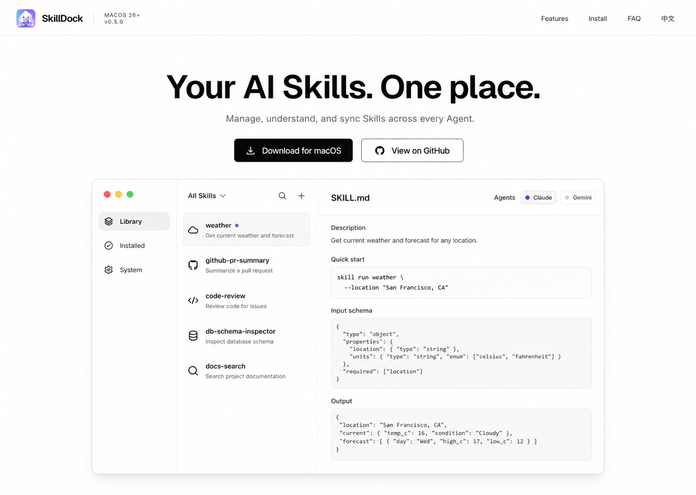

# Vercel-Style GitHub Landing Page Design

## Goal

Redesign the standalone SkillDock GitHub introduction page into a clean, product-led landing page inspired by Vercel's visual restraint while preserving SkillDock's own identity and accurate V0.5 content.

## Selected Direction

Use the approved “Product Grid” concept as the visual target:

The page uses a bright white base, black and cool-gray typography, thin dividers, compact navigation, and a small blue-purple brand accent. Typography changes to a modern neutral sans-serif system; the current editorial serif and italic styling are removed.

## Page Structure

### Navigation

- Keep the SkillDock icon, product name, macOS 26+, V0.5.0, feature links, install link, FAQ link, and language toggle.
- Use a compact 64-pixel navigation bar with a subtle bottom divider.
- Keep all existing destinations and bilingual behavior.

### Hero

- Center the headline: `Your AI Skills. One place.`
- Use one concise supporting sentence and two actions: download and GitHub.
- Place the product visual below the actions rather than beside the copy.
- Remove the external screenshot asset from the rendered page.

### Code-Native Product Visual

Build a simplified three-column SkillDock interface directly in HTML and CSS:

1. Sidebar: Library, Installed, System.
2. Skill list: realistic examples such as `weather`, `github-pr-summary`, and `code-review`.
3. Detail: selected Skill name, short description, Original / Translation state, and a compact `SKILL.md` content preview.
4. Agent status: small Codex, Claude, Gemini, and OpenCode labels.

This visual is intentionally simplified and is not a 1:1 recreation of the macOS app. It communicates the real information architecture without exposing private user data or requiring screenshot maintenance.

## Feature Presentation

- Replace floating feature cards with a flatter grid using dividers and restrained hover feedback.
- Prioritize six truthful capabilities: unified library, local and GitHub import, safe Agent sync, manual update checks, optional Chinese translation, and local-first open source.
- Remove decorative arrow circles and heavy card shadows.

## Download, Install, And FAQ

- Keep the current accurate V0.5 content and GitHub Release ZIP flow.
- Use black or neutral surfaces rather than the current bright-blue full-width CTA band.
- Preserve FAQ expansion and language switching.
- Keep privacy wording explicit: translation sends only the selected `SKILL.md` content to DeepSeek using the user's API key.

## Responsive Behavior

- Desktop: centered hero and full three-column product visual.
- Tablet: keep the product visual readable with narrower columns.
- Mobile: stack the product visual into sidebar summary, Skill list, and detail preview; keep both main actions visible without horizontal overflow.
- Navigation hides secondary links on compact screens but retains brand, version, and language toggle.

## Interaction

- Existing smooth anchor navigation, language switching, FAQ expansion, hover, and focus states remain functional.
- Product visual is illustrative and does not introduce fake controls or new routes.
- Respect `prefers-reduced-motion` by disabling nonessential reveal animation.

## Validation

- Compare the 1440 × 1024 implementation against the selected Product Grid reference.
- Verify 390 × 844 mobile layout with no horizontal overflow.
- Verify English and Chinese switching, FAQ expansion, links, console health, keyboard focus, and reduced-motion behavior.
- Confirm no Homebrew, DMG, Registry, or outdated version claims return.

## Scope Boundaries

- Edit only the standalone landing page and its obsolete screenshot dependency.
- Do not change the SkillDock macOS application.
- Do not introduce a frontend framework, build step, or new runtime dependency.
